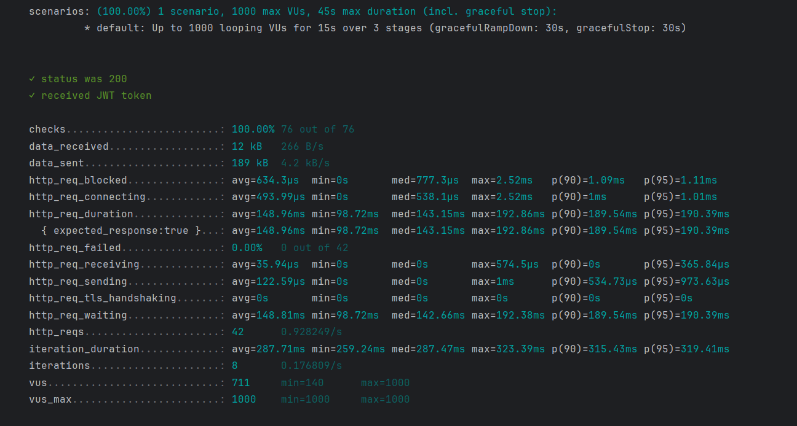

## Table of Contents

- [Table of Contents](#table-of-contents)
- [О проекте](#о-проекте)
- [Структура проекта](#структура-проекта)
- [Реализованный функционал](#реализованный-функционал)
- [Результаты нагрузочного тестирования](#результаты-нагрузочного-тестирования)
- [Запрос на фидбек](#запрос-на-фидбек)
- [Требования](#требования)
- [Сборка](#сборка)
- [Использование](#использование)
- [Спасибо за внимание](#cпасибо-за-внимание)


## О проекте
Данный проект подготовлен в рамках отбора на стажировку в авито.
Описание задания можно увидеть по [ссылке](https://github.com/avito-tech/tech-internship/blob/main/Tech%20Internships/Backend/Backend-trainee-assignment-winter-2025/Backend-trainee-assignment-winter-2025.md) 
или в файлах находящихся в директории docs.
## Структура проекта

```plaintext
.
├── docs/                       # Документация проекта
├── internal/                   # Основной код приложения
│   ├── app/                    # Регистрация слоев, роутера и его запуск
│   ├── cmd/                    # Точка входа для приложения
│   ├── config/                 # Файлы конфигурации
│   ├── controllers/            # Слой контроллеров
│   ├── entities/               # Слой бизнес-сущностей
│   ├── middleware/             # Middleware
│   ├── pkg/                    # Дополнительные кастомные библиотеки
│   │   ├── errorsx/            # Кастомные ошибки
│   │   └── jwttoken/           # Сервис для генерации JWT-токенов
│   ├── repository/             # Слой репозитория
│   └── service/                # Слой бизнес-логики
├── migration/                  # Миграции для создания таблиц
├── tests/                      # Тесты
│   ├── integration/            # Интеграционные тесты
│   │   ├── migrations/         # Миграции для интеграционных тестов
│   │   └── test_repository/    # Инициализация тестового репозитория
│   ├── load/                   # Нагрузочные тесты
│   └── unit/                   # Unit-тесты
```

## Реализованный функционал
Реализована основная необходимая логика описанная к контракту к проекту.
Написаны unit тесты ко всем методам сервисного слоя.
Написаны интеграционные тесты с проверкой логики перевода денежных средств и покупки мерча. 
Написан и запущен минимальный линтер.

## Результаты нагрузочного тестирования
При проведении финального теста были выставлены следующие этапы:
1) { duration: '5s', target: 850 }:
В течение 5 секунд количество виртуальных пользователей будет увеличиваться до 850.
2) { duration: '5s', target: 1000 }:
В течение следующих 5 секунд количество пользователей увеличится до 1000.
3) { duration: '5s', target: 700 }:
В течение последних 5 секунд количество пользователей уменьшится до 700.
Тестирование проводилось только по ручкам /api/auth и /api/info
Получили следующие результаты.

 Основные метрики:
Среднее время ответа: 148.69 мс.
Минимальное время ответа: 98.72 мс.
Максимальное время ответа: 192.86 мс.
Процент ошибок: 0% (все запросы выполнены успешно).

Анализ:
Среднее время ответа (148.69 мс) превышает целевой порог в 50 мс, что указывает на необходимость оптимизации.
При уменьшении количества виртуальных пользователей (VUs) время ответа сокращается, что свидетельствует о зависимости производительности от нагрузки.
Предполагается, что ограничения вызваны техническими характеристиками машины, на которой проводилось тестирование.

## Запрос на фидбек:

1) Прошу предоставить результаты тестирования на более мощной машине, чтобы оценить, как сервис справляется с нагрузкой при улучшенных технических характеристиках.

2) Прошу предоставить фидбек по текущей реализации кода и рекомендации по его оптимизации. В частности, возможности улучшения производительности сервиса.


## Требования

Убедитесь, что следующие инструменты установлены:

- [Go 1.23+](https://golang.org/dl/)
- [Docker](https://www.docker.com/products/docker-desktop)
- [Docker Compose](https://docs.docker.com/compose/install/)

## Сборка

1. Клонируйте репозиторий:

    ```bash
    git clone https://github.com/ZhdanovichVlad/zhvAvitoPrivat
    ```


2. Запустите сервисы с помощью Docker Compose:

    ```bash
    docker-compose up
    ```
3. Запустить интеграционные и unit тесты можно из соотвествующей директории в \github\ZhdanovichVlad\zhvAvitoPrivat\tests:

    ```bash
    go test
    ```
4. Запустить нагрузочный тест можно из  директории \github\ZhdanovichVlad\zhvAvitoPrivat\tests\load:

    ```bash
     k6 run loadTest.js
    ```

## Использование

Приложение будет доступно по адресу `0.0.0.0:8080`

## Спасибо за внимание


